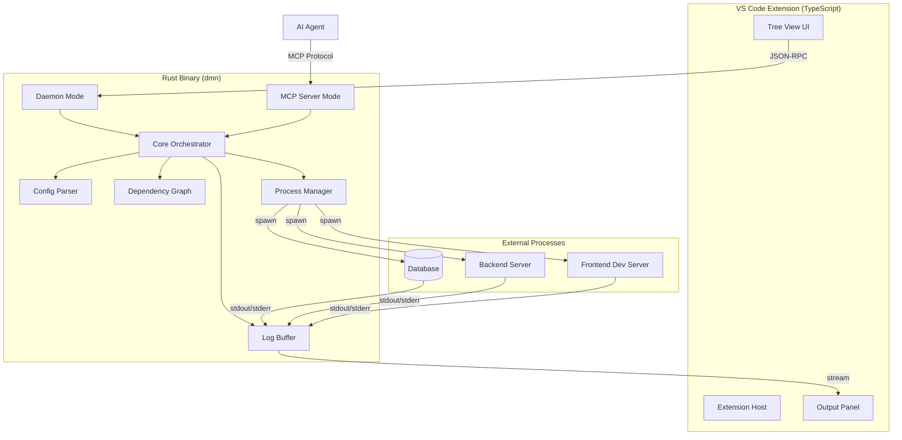

# Design Document

## Overview

OpenDaemon (`dmn`) is architected as a hybrid system combining a Rust-based orchestration engine with a TypeScript VS Code extension. The Rust core handles all process management, log streaming, and MCP server functionality, while the TypeScript extension provides the UI layer and VS Code integration. This design ensures high performance for process management while maintaining a native VS Code experience.

The system follows a client-server architecture where the VS Code extension communicates with the Rust binary via JSON-RPC over stdin/stdout. The MCP server runs as a separate mode of the same Rust binary, exposing tools to AI agents via the Model Context Protocol standard.

## Architecture

### High-Level Component Diagram



### Communication Flow

1. **Extension → Rust Binary**: JSON-RPC messages over stdin/stdout
2. **Rust Binary → Spawned Processes**: Standard process spawning with piped stdout/stderr
3. **AI Agent → MCP Server**: Model Context Protocol over stdio (separate process instance)
4. **Logs → Extension**: Streamed via JSON-RPC events

## Components and Interfaces

### 1. Configuration Parser (`config.rs`)

**Responsibility**: Parse and validate `dmn.json` files.

**Data Structures**:

```rust
#[derive(Debug, Deserialize, Serialize)]
pub struct DmnConfig {
    pub version: String,
    pub services: HashMap<String, ServiceConfig>,
}

#[derive(Debug, Deserialize, Serialize, Clone)]
pub struct ServiceConfig {
    pub command: String,
    #[serde(default)]
    pub depends_on: Vec<String>,
    pub ready_when: Option<ReadyCondition>,
    pub env_file: Option<String>,
}

#[derive(Debug, Deserialize, Serialize, Clone)]
#[serde(tag = "type", rename_all = "snake_case")]
pub enum ReadyCondition {
    LogContains { pattern: String },
    UrlResponds { url: String },
}
```

**Key Methods**:
- `parse_config(path: &Path) -> Result<DmnConfig, ConfigError>`
- `validate_config(config: &DmnConfig) -> Result<(), ValidationError>`
- `load_env_file(path: &Path) -> Result<HashMap<String, String>, IoError>`

**Validation Rules**:
- Check for circular dependencies
- Verify all services in `depends_on` exist
- Validate regex patterns in `ready_when` conditions
- Ensure commands are not empty

### 2. Dependency Graph (`graph.rs`)

**Responsibility**: Build and traverse service dependency graphs.

**Implementation**: Use the `petgraph` crate for DAG operations.

```rust
use petgraph::graph::{DiGraph, NodeIndex};
use petgraph::algo::toposort;

pub struct ServiceGraph {
    graph: DiGraph<String, ()>,
    node_map: HashMap<String, NodeIndex>,
}

impl ServiceGraph {
    pub fn from_config(config: &DmnConfig) -> Result<Self, GraphError> {
        // Build graph from service dependencies
    }
    
    pub fn get_start_order(&self) -> Result<Vec<String>, CycleError> {
        // Topological sort to determine start order
    }
    
    pub fn get_dependents(&self, service: &str) -> Vec<String> {
        // Get services that depend on this service
    }
}
```

**Error Handling**:
- Detect cycles using `petgraph::algo::is_cyclic_directed`
- Return detailed error messages listing services in the cycle

### 3. Process Manager (`process.rs`)

**Responsibility**: Spawn, monitor, and control service processes.

```rust
use tokio::process::{Command, Child};
use tokio::io::{BufReader, AsyncBufReadExt};

pub struct ProcessManager {
    processes: HashMap<String, ManagedProcess>,
    log_buffer: Arc<Mutex<LogBuffer>>,
}

pub struct ManagedProcess {
    service_name: String,
    child: Child,
    status: ServiceStatus,
    started_at: SystemTime,
    env_vars: HashMap<String, String>,
}

#[derive(Debug, Clone, PartialEq)]
pub enum ServiceStatus {
    NotStarted,
    Starting,
    Running,
    Stopped,
    Failed { exit_code: i32 },
}

impl ProcessManager {
    pub async fn spawn_service(
        &mut self,
        service_name: &str,
        config: &ServiceConfig,
    ) -> Result<(), SpawnError> {
        // Spawn process with environment variables
        // Set up stdout/stderr streaming
    }
    
    pub async fn stop_service(&mut self, service_name: &str) -> Result<(), StopError> {
        // Send SIGTERM, wait for graceful shutdown
        // Force kill after timeout
    }
    
    pub async fn restart_service(&mut self, service_name: &str) -> Result<(), RestartError> {
        // Stop then start
    }
    
    pub fn get_status(&self, service_name: &str) -> Option<ServiceStatus> {
        // Return current status
    }
}
```

**Process Lifecycle**:
1. Parse command string (handle shell syntax)
2. Set up environment variables (merge from env_file and system)
3. Spawn with `tokio::process::Command`
4. Pipe stdout and stderr to separate async tasks
5. Monitor exit status
6. Update status and notify listeners

**Graceful Shutdown**:
- Send SIGTERM (or equivalent on Windows)
- Wait up to 10 seconds
- Send SIGKILL if still running
- Clean up resources

### 4. Log Buffer (`logs.rs`)

**Responsibility**: Store and retrieve service logs efficiently.

```rust
use std::collections::VecDeque;

pub struct LogBuffer {
    buffers: HashMap<String, CircularBuffer>,
    max_lines_per_service: usize,
}

pub struct CircularBuffer {
    lines: VecDeque<LogLine>,
    max_size: usize,
}

pub struct LogLine {
    pub timestamp: SystemTime,
    pub content: String,
    pub stream: LogStream,
}

pub enum LogStream {
    Stdout,
    Stderr,
}

impl LogBuffer {
    pub fn append(&mut self, service: &str, line: LogLine) {
        // Add line to circular buffer
        // Evict oldest if at capacity
    }
    
    pub fn get_lines(&self, service: &str, count: LogLineCount) -> Vec<LogLine> {
        // Return requested number of lines
    }
    
    pub fn get_all_lines(&self, service: &str) -> Vec<LogLine> {
        // Return all available lines
    }
}

pub enum LogLineCount {
    Last(usize),
    All,
}
```

**Configuration**:
- Default buffer size: 1000 lines per service
- Configurable via environment variable `DMN_LOG_BUFFER_SIZE`

### 5. Ready Watcher (`ready.rs`)

**Responsibility**: Monitor service output and determine readiness.

```rust
pub struct ReadyWatcher {
    conditions: HashMap<String, ReadyCondition>,
    ready_services: HashSet<String>,
}

impl ReadyWatcher {
    pub async fn watch_service(
        &mut self,
        service_name: String,
        condition: ReadyCondition,
        log_rx: mpsc::Receiver<LogLine>,
    ) {
        match condition {
            ReadyCondition::LogContains { pattern } => {
                self.watch_log_pattern(service_name, pattern, log_rx).await
            }
            ReadyCondition::UrlResponds { url } => {
                self.watch_url(service_name, url).await
            }
        }
    }
    
    async fn watch_log_pattern(
        &mut self,
        service_name: String,
        pattern: String,
        mut log_rx: mpsc::Receiver<LogLine>,
    ) {
        let regex = Regex::new(&pattern).unwrap();
        while let Some(line) = log_rx.recv().await {
            if regex.is_match(&line.content) {
                self.mark_ready(&service_name);
                break;
            }
        }
    }
    
    async fn watch_url(&mut self, service_name: String, url: String) {
        let client = reqwest::Client::new();
        loop {
            if let Ok(response) = client.get(&url).send().await {
                if response.status().is_success() {
                    self.mark_ready(&service_name);
                    break;
                }
            }
            tokio::time::sleep(Duration::from_millis(500)).await;
        }
    }
    
    fn mark_ready(&mut self, service_name: &str) {
        self.ready_services.insert(service_name.to_string());
        // Emit ready event
    }
}
```

### 6. Core Orchestrator (`orchestrator.rs`)

**Responsibility**: Coordinate all components and manage service lifecycle.

```rust
pub struct Orchestrator {
    config: DmnConfig,
    graph: ServiceGraph,
    process_manager: ProcessManager,
    log_buffer: Arc<Mutex<LogBuffer>>,
    ready_watcher: ReadyWatcher,
    event_tx: mpsc::Sender<OrchestratorEvent>,
}

#[derive(Debug, Clone)]
pub enum OrchestratorEvent {
    ServiceStarting { service: String },
    ServiceReady { service: String },
    ServiceFailed { service: String, error: String },
    ServiceStopped { service: String },
    LogLine { service: String, line: LogLine },
}

impl Orchestrator {
    pub async fn start_all(&mut self) -> Result<(), OrchestratorError> {
        let start_order = self.graph.get_start_order()?;
        
        for service_name in start_order {
            self.start_service_with_deps(&service_name).await?;
        }
        
        Ok(())
    }
    
    async fn start_service_with_deps(&mut self, service_name: &str) -> Result<(), OrchestratorError> {
        // Check if dependencies are ready
        let deps = self.graph.get_dependencies(service_name);
        for dep in deps {
            if !self.ready_watcher.is_ready(&dep) {
                self.wait_for_ready(&dep).await?;
            }
        }
        
        // Start the service
        let config = self.config.services.get(service_name).unwrap();
        self.process_manager.spawn_service(service_name, config).await?;
        
        // Set up ready watching if configured
        if let Some(ready_condition) = &config.ready_when {
            self.ready_watcher.watch_service(
                service_name.to_string(),
                ready_condition.clone(),
                self.get_log_receiver(service_name),
            ).await;
        } else {
            self.ready_watcher.mark_ready(service_name);
        }
        
        Ok(())
    }
    
    pub async fn stop_all(&mut self) -> Result<(), OrchestratorError> {
        // Stop in reverse dependency order
        let stop_order: Vec<_> = self.graph.get_start_order()?.into_iter().rev().collect();
        
        for service_name in stop_order {
            self.process_manager.stop_service(&service_name).await?;
        }
        
        Ok(())
    }
    
    pub async fn stop_service(&mut self, service_name: &str) -> Result<(), OrchestratorError> {
        // Stop dependents first
        let dependents = self.graph.get_dependents(service_name);
        for dependent in dependents {
            self.process_manager.stop_service(&dependent).await?;
        }
        
        // Stop the service itself
        self.process_manager.stop_service(service_name).await?;
        
        Ok(())
    }
}
```

### 7. JSON-RPC Server (`rpc.rs`)

**Responsibility**: Handle communication between VS Code extension and Rust binary.

```rust
use serde_json::{json, Value};

pub struct RpcServer {
    orchestrator: Arc<Mutex<Orchestrator>>,
}

#[derive(Debug, Deserialize)]
#[serde(tag = "method", content = "params")]
pub enum RpcRequest {
    StartAll,
    StopAll,
    StartService { service: String },
    StopService { service: String },
    RestartService { service: String },
    GetStatus,
    GetLogs { service: String, lines: Option<usize> },
}

#[derive(Debug, Serialize)]
pub struct RpcResponse {
    pub id: u64,
    pub result: Option<Value>,
    pub error: Option<RpcError>,
}

impl RpcServer {
    pub async fn handle_request(&self, request: RpcRequest) -> RpcResponse {
        match request {
            RpcRequest::StartAll => {
                let mut orch = self.orchestrator.lock().await;
                match orch.start_all().await {
                    Ok(_) => RpcResponse::success(json!({"status": "started"})),
                    Err(e) => RpcResponse::error(e.to_string()),
                }
            }
            RpcRequest::GetLogs { service, lines } => {
                let orch = self.orchestrator.lock().await;
                let log_buffer = orch.log_buffer.lock().await;
                let lines = log_buffer.get_lines(&service, lines.map_or(LogLineCount::All, LogLineCount::Last));
                RpcResponse::success(json!({"logs": lines}))
            }
            // ... other methods
        }
    }
}
```

### 8. MCP Server (`mcp_server.rs`)

**Responsibility**: Expose tools to AI agents via Model Context Protocol.

```rust
use mcp_sdk::{Server, Tool, ToolCall, ToolResult};

pub struct DmnMcpServer {
    orchestrator: Arc<Mutex<Orchestrator>>,
}

impl DmnMcpServer {
    pub fn new(orchestrator: Arc<Mutex<Orchestrator>>) -> Self {
        Self { orchestrator }
    }
    
    pub async fn run(&self) -> Result<(), McpError> {
        let server = Server::new("dmn", "1.0.0");
        
        server.register_tool(Tool {
            name: "read_logs".to_string(),
            description: "Read logs from a specific service".to_string(),
            parameters: json!({
                "type": "object",
                "properties": {
                    "service": {
                        "type": "string",
                        "description": "Name of the service to read logs from"
                    },
                    "lines": {
                        "oneOf": [
                            {"type": "number"},
                            {"type": "string", "enum": ["all"]}
                        ],
                        "description": "Number of lines to return, or 'all' for all available lines"
                    }
                },
                "required": ["service", "lines"]
            }),
        });
        
        server.register_tool(Tool {
            name: "get_service_status".to_string(),
            description: "Get the current status of all services".to_string(),
            parameters: json!({"type": "object", "properties": {}}),
        });
        
        server.register_tool(Tool {
            name: "list_services".to_string(),
            description: "List all services defined in dmn.json".to_string(),
            parameters: json!({"type": "object", "properties": {}}),
        });
        
        server.on_tool_call(|call: ToolCall| async move {
            self.handle_tool_call(call).await
        });
        
        server.listen_stdio().await?;
        Ok(())
    }
    
    async fn handle_tool_call(&self, call: ToolCall) -> ToolResult {
        match call.name.as_str() {
            "read_logs" => {
                let service = call.params["service"].as_str().unwrap();
                let lines = match &call.params["lines"] {
                    Value::String(s) if s == "all" => LogLineCount::All,
                    Value::Number(n) => LogLineCount::Last(n.as_u64().unwrap() as usize),
                    _ => return ToolResult::error("Invalid lines parameter"),
                };
                
                let orch = self.orchestrator.lock().await;
                let log_buffer = orch.log_buffer.lock().await;
                let log_lines = log_buffer.get_lines(service, lines);
                
                ToolResult::success(json!({
                    "service": service,
                    "logs": log_lines.iter().map(|l| l.content.clone()).collect::<Vec<_>>()
                }))
            }
            "get_service_status" => {
                let orch = self.orchestrator.lock().await;
                let statuses: HashMap<String, String> = orch.config.services.keys()
                    .map(|name| {
                        let status = orch.process_manager.get_status(name)
                            .map(|s| format!("{:?}", s))
                            .unwrap_or_else(|| "Unknown".to_string());
                        (name.clone(), status)
                    })
                    .collect();
                
                ToolResult::success(json!({"services": statuses}))
            }
            "list_services" => {
                let orch = self.orchestrator.lock().await;
                let services: Vec<String> = orch.config.services.keys().cloned().collect();
                ToolResult::success(json!({"services": services}))
            }
            _ => ToolResult::error("Unknown tool"),
        }
    }
}
```

### 9. VS Code Extension (`extension.ts`)

**Responsibility**: Provide UI and VS Code integration.

```typescript
import * as vscode from 'vscode';
import { spawn, ChildProcess } from 'child_process';

export class DmnExtension {
    private dmnProcess: ChildProcess | null = null;
    private treeDataProvider: ServiceTreeDataProvider;
    private outputChannel: vscode.OutputChannel;
    
    constructor(context: vscode.ExtensionContext) {
        this.outputChannel = vscode.window.createOutputChannel('OpenDaemon');
        this.treeDataProvider = new ServiceTreeDataProvider();
        
        vscode.window.registerTreeDataProvider('dmnServices', this.treeDataProvider);
        
        this.registerCommands(context);
        this.startDmnDaemon();
    }
    
    private startDmnDaemon() {
        const binaryPath = this.getBinaryPath();
        this.dmnProcess = spawn(binaryPath, ['daemon'], {
            stdio: ['pipe', 'pipe', 'pipe']
        });
        
        this.dmnProcess.stdout?.on('data', (data) => {
            this.handleRpcMessage(JSON.parse(data.toString()));
        });
    }
    
    private async sendRpcRequest(method: string, params?: any): Promise<any> {
        const request = {
            jsonrpc: '2.0',
            id: Date.now(),
            method,
            params
        };
        
        this.dmnProcess?.stdin?.write(JSON.stringify(request) + '\n');
        
        // Wait for response (implement proper request/response matching)
        return new Promise((resolve) => {
            // ... response handling
        });
    }
    
    private registerCommands(context: vscode.ExtensionContext) {
        context.subscriptions.push(
            vscode.commands.registerCommand('dmn.startAll', async () => {
                await this.sendRpcRequest('StartAll');
            })
        );
        
        context.subscriptions.push(
            vscode.commands.registerCommand('dmn.stopAll', async () => {
                await this.sendRpcRequest('StopAll');
            })
        );
        
        context.subscriptions.push(
            vscode.commands.registerCommand('dmn.showLogs', async (service: string) => {
                const logs = await this.sendRpcRequest('GetLogs', { service, lines: 'all' });
                this.outputChannel.clear();
                this.outputChannel.appendLine(`=== Logs for ${service} ===`);
                logs.forEach((line: string) => this.outputChannel.appendLine(line));
                this.outputChannel.show();
            })
        );
    }
}

class ServiceTreeDataProvider implements vscode.TreeDataProvider<ServiceTreeItem> {
    private _onDidChangeTreeData = new vscode.EventEmitter<ServiceTreeItem | undefined>();
    readonly onDidChangeTreeData = this._onDidChangeTreeData.event;
    
    private services: Map<string, ServiceStatus> = new Map();
    
    getTreeItem(element: ServiceTreeItem): vscode.TreeItem {
        return element;
    }
    
    getChildren(element?: ServiceTreeItem): ServiceTreeItem[] {
        if (!element) {
            return Array.from(this.services.entries()).map(([name, status]) => 
                new ServiceTreeItem(name, status)
            );
        }
        return [];
    }
    
    updateServices(services: Map<string, ServiceStatus>) {
        this.services = services;
        this._onDidChangeTreeData.fire(undefined);
    }
}

class ServiceTreeItem extends vscode.TreeItem {
    constructor(
        public readonly serviceName: string,
        public readonly status: ServiceStatus
    ) {
        super(serviceName, vscode.TreeItemCollapsibleState.None);
        this.iconPath = this.getIconForStatus(status);
        this.contextValue = 'service';
        this.command = {
            command: 'dmn.showLogs',
            title: 'Show Logs',
            arguments: [serviceName]
        };
    }
    
    private getIconForStatus(status: ServiceStatus): vscode.ThemeIcon {
        switch (status) {
            case 'Running': return new vscode.ThemeIcon('pass', new vscode.ThemeColor('testing.iconPassed'));
            case 'Starting': return new vscode.ThemeIcon('sync~spin');
            case 'Failed': return new vscode.ThemeIcon('error', new vscode.ThemeColor('testing.iconFailed'));
            case 'Stopped': return new vscode.ThemeIcon('circle-outline');
            default: return new vscode.ThemeIcon('question');
        }
    }
}
```

## Data Models

### Configuration Schema

```json
{
  "$schema": "http://json-schema.org/draft-07/schema#",
  "type": "object",
  "required": ["version", "services"],
  "properties": {
    "version": {
      "type": "string",
      "pattern": "^\\d+\\.\\d+$"
    },
    "services": {
      "type": "object",
      "patternProperties": {
        "^[a-zA-Z0-9_-]+$": {
          "type": "object",
          "required": ["command"],
          "properties": {
            "command": {
              "type": "string",
              "minLength": 1
            },
            "depends_on": {
              "type": "array",
              "items": {
                "type": "string"
              }
            },
            "ready_when": {
              "oneOf": [
                {
                  "type": "object",
                  "required": ["log_contains"],
                  "properties": {
                    "log_contains": {
                      "type": "string"
                    }
                  }
                },
                {
                  "type": "object",
                  "required": ["url_responds"],
                  "properties": {
                    "url_responds": {
                      "type": "string",
                      "format": "uri"
                    }
                  }
                }
              ]
            },
            "env_file": {
              "type": "string"
            }
          }
        }
      }
    }
  }
}
```

## Error Handling

### Error Types

```rust
#[derive(Debug, thiserror::Error)]
pub enum DmnError {
    #[error("Configuration error: {0}")]
    Config(#[from] ConfigError),
    
    #[error("Dependency cycle detected: {0}")]
    CyclicDependency(String),
    
    #[error("Service not found: {0}")]
    ServiceNotFound(String),
    
    #[error("Failed to spawn process: {0}")]
    SpawnError(#[from] std::io::Error),
    
    #[error("Service failed: {service} exited with code {exit_code}")]
    ServiceFailed { service: String, exit_code: i32 },
    
    #[error("Timeout waiting for service: {0}")]
    ReadyTimeout(String),
}
```

### Error Recovery Strategies

1. **Configuration Errors**: Display detailed error message in VS Code notification, highlight problematic line if possible
2. **Service Failures**: Mark service as failed, display last 50 log lines, allow manual restart
3. **Dependency Failures**: Stop dependent services, notify user of cascade
4. **Timeout Errors**: Allow user to increase timeout or skip ready check

## Testing Strategy

### Unit Tests

1. **Config Parser Tests**
   - Valid configurations
   - Invalid JSON
   - Missing required fields
   - Circular dependencies
   - Invalid regex patterns

2. **Dependency Graph Tests**
   - Simple linear dependencies
   - Complex multi-level dependencies
   - Cycle detection
   - Topological sort correctness

3. **Process Manager Tests**
   - Spawn and capture output
   - Graceful shutdown
   - Force kill after timeout
   - Environment variable injection

4. **Log Buffer Tests**
   - Circular buffer behavior
   - Line eviction
   - Concurrent access
   - Query by count

5. **Ready Watcher Tests**
   - Log pattern matching
   - URL polling
   - Timeout handling
   - Multiple concurrent watches

### Integration Tests

1. **End-to-End Orchestration**
   - Start services in correct order
   - Wait for readiness before starting dependents
   - Stop services in reverse order
   - Handle service failures

2. **JSON-RPC Communication**
   - Request/response matching
   - Error propagation
   - Event streaming

3. **MCP Server**
   - Tool registration
   - Tool call handling
   - Error responses
   - Authentication (when implemented)

### Manual Testing Scenarios

1. **Happy Path**: Start all services, verify logs, stop all
2. **Service Failure**: Kill a service manually, verify cascade stop
3. **Configuration Reload**: Modify dmn.json, verify reload
4. **AI Integration**: Use Cursor/Copilot to call MCP tools
5. **Cross-Platform**: Test on Windows, macOS, Linux

## Performance Considerations

1. **Log Buffer Size**: Default 1000 lines per service, configurable
2. **Process Monitoring**: Use async I/O to avoid blocking
3. **Memory Usage**: Circular buffers prevent unbounded growth
4. **Startup Time**: Parallel dependency resolution where possible
5. **Shutdown Time**: 10-second grace period before force kill

## Security Considerations

1. **Command Injection**: Validate and sanitize commands (future: use shell escaping)
2. **Environment Variables**: Don't log sensitive env vars
3. **MCP Authentication**: Require token for MCP server access (Pro feature)
4. **File Access**: Restrict to workspace directory
5. **Process Isolation**: Use OS-level process groups for clean termination

## Future Enhancements

1. **Auto-restart on failure**: Configurable restart policies
2. **Health checks**: Periodic URL polling even after ready
3. **Resource limits**: CPU/memory constraints per service
4. **Log filtering**: Regex-based log filtering in UI
5. **Service groups**: Start/stop groups of related services
6. **Remote services**: SSH-based remote process management
7. **Docker integration**: Native docker-compose parsing
