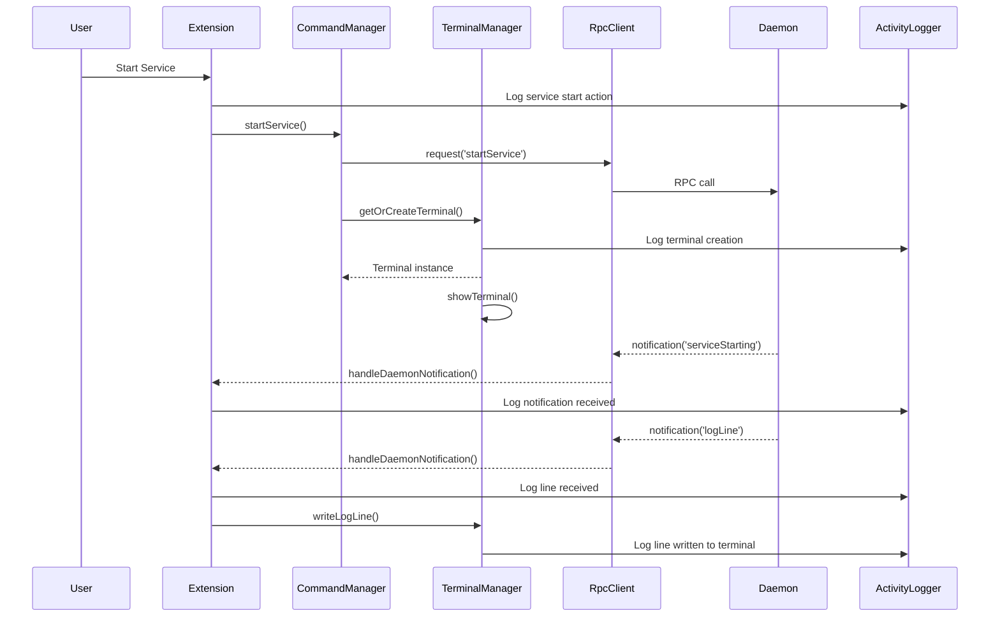

# Design Document: Terminal Auto-Creation and Logging

## Overview

This design addresses the terminal integration feature in the OpenDaemon VSCode extension. The feature will automatically create terminals for services when they start and stream logs in real-time. Additionally, comprehensive activity logging will be added throughout the extension to aid in debugging and troubleshooting.

The solution involves:
1. Wiring the `TerminalManager` to automatically create terminals when services start
2. Connecting the daemon's 'logLine' notifications to the `TerminalManager` for real-time streaming
3. Creating a new "OpenDaemon Activity" output channel for extension activity logging
4. Enhancing error logging with detailed context information

## Architecture

### Component Interaction Flow



### Key Design Decisions

1. **Automatic Terminal Creation**: Terminals will be created in the `startService()` command handler immediately after the RPC request is sent, ensuring the terminal is ready before logs arrive.

2. **Dual Log Routing**: Log lines from the daemon will be routed to both the `LogManager` (for editor-based viewing) and the `TerminalManager` (for terminal-based viewing), maintaining backward compatibility.

3. **Activity Logging**: A dedicated output channel will log all extension activities, separate from the existing "OpenDaemon Errors" channel, providing a complete audit trail.

4. **Pseudoterminal vs sendText**: The current implementation uses `sendText()` with echo commands. This design will evaluate switching to `Pseudoterminal` for better control over output formatting and performance.

## Components and Interfaces

### 1. ActivityLogger

A new singleton class for managing extension activity logging.

```typescript
export class ActivityLogger {
    private outputChannel: vscode.OutputChannel;
    
    constructor() {
        this.outputChannel = vscode.window.createOutputChannel('OpenDaemon Activity');
    }
    
    /**
     * Log a general activity message
     */
    log(message: string): void {
        const timestamp = new Date().toISOString();
        this.outputChannel.appendLine(`[${timestamp}] ${message}`);
    }
    
    /**
     * Log a service-related action
     */
    logServiceAction(service: string, action: string, details?: string): void {
        const detailsStr = details ? ` - ${details}` : '';
        this.log(`Service [${service}]: ${action}${detailsStr}`);
    }
    
    /**
     * Log a terminal-related action
     */
    logTerminalAction(service: string, action: string, details?: string): void {
        const detailsStr = details ? ` - ${details}` : '';
        this.log(`Terminal [${service}]: ${action}${detailsStr}`);
    }
    
    /**
     * Log an RPC-related action
     */
    logRpcAction(method: string, direction: 'request' | 'response' | 'notification', details?: string): void {
        const detailsStr = details ? ` - ${details}` : '';
        this.log(`RPC [${method}] ${direction}${detailsStr}`);
    }
    
    /**
     * Log an error with context
     */
    logError(context: string, error: Error | string): void {
        const errorMsg = error instanceof Error ? error.message : error;
        this.log(`ERROR in ${context}: ${errorMsg}`);
    }
    
    /**
     * Show the activity log output channel
     */
    show(): void {
        this.outputChannel.show();
    }
    
    /**
     * Dispose of resources
     */
    dispose(): void {
        this.outputChannel.dispose();
    }
}
```

### 2. Enhanced TerminalManager

The existing `TerminalManager` will be enhanced with activity logging and improved log line handling.

**New Methods:**

```typescript
/**
 * Write a single log line to a service's terminal
 * @param serviceName Name of the service
 * @param logLine Log line with timestamp, content, and stream type
 */
writeLogLine(serviceName: string, logLine: LogLine): void {
    const terminal = this.getOrCreateTerminal(serviceName);
    
    // Format the log line with timestamp and stream indicator
    const streamPrefix = logLine.stream === 'stderr' ? '[stderr]' : '[stdout]';
    const formattedLine = `${logLine.timestamp} ${streamPrefix} ${logLine.content}`;
    
    // Write to terminal
    terminal.sendText(`echo "${this.escapeForShell(formattedLine)}"`, false);
    
    // Log activity
    if (this.activityLogger) {
        this.activityLogger.logTerminalAction(
            serviceName,
            'Log line written',
            `stream: ${logLine.stream}`
        );
    }
}

/**
 * Set the activity logger instance
 */
setActivityLogger(logger: ActivityLogger): void {
    this.activityLogger = logger;
}
```

**Modified Methods:**

The `getOrCreateTerminal()` method will be enhanced to log terminal creation:

```typescript
getOrCreateTerminal(serviceName: string): vscode.Terminal {
    let terminal = this.terminals.get(serviceName);

    if (!terminal || terminal.exitStatus !== undefined) {
        // Terminal doesn't exist or was closed, create a new one
        terminal = vscode.window.createTerminal({
            name: `dmn: ${serviceName}`,
            iconPath: new vscode.ThemeIcon('server-process'),
            isTransient: false,
        });

        this.terminals.set(serviceName, terminal);
        
        // Log terminal creation
        if (this.activityLogger) {
            this.activityLogger.logTerminalAction(serviceName, 'Terminal created');
        }
    }

    return terminal;
}
```

### 3. Modified CommandManager

The `CommandManager` will be updated to automatically create and show terminals when services start.

**Modified startService() method:**

```typescript
private async startService(item?: ServiceTreeItem): Promise<void> {
    const targetItem = await this.getServiceItem(item);
    if (!targetItem) {
        return;
    }

    const rpcClient = this.getRpcClient();
    if (!rpcClient) {
        vscode.window.showErrorMessage('OpenDaemon is not running');
        return;
    }

    try {
        // Log the action
        if (this.activityLogger) {
            this.activityLogger.logServiceAction(targetItem.serviceName, 'Starting service');
        }
        
        // Create and show terminal immediately (before service starts)
        this.terminalManager.showTerminal(targetItem.serviceName, true);
        
        // Log terminal shown
        if (this.activityLogger) {
            this.activityLogger.logTerminalAction(
                targetItem.serviceName,
                'Terminal shown',
                'preserveFocus: true'
            );
        }

        await vscode.window.withProgress(
            {
                location: vscode.ProgressLocation.Notification,
                title: `Starting ${targetItem.serviceName}...`,
                cancellable: false
            },
            async () => {
                await rpcClient.request('startService', { service: targetItem.serviceName });
            }
        );

        vscode.window.showInformationMessage(`Service ${targetItem.serviceName} started`);
        
        // Log success
        if (this.activityLogger) {
            this.activityLogger.logServiceAction(targetItem.serviceName, 'Service started successfully');
        }
    } catch (err) {
        const errorMessage = err instanceof Error ? err.message : String(err);
        
        // Log error
        if (this.activityLogger) {
            this.activityLogger.logError(
                `startService(${targetItem.serviceName})`,
                errorMessage
            );
        }
        
        vscode.window.showErrorMessage(
            `Failed to start ${targetItem.serviceName}: ${errorMessage}`
        );
    }
}
```

Similar modifications will be applied to `startAll()`, `restartService()`, `stopService()`, and `stopAll()` methods.

### 4. Modified Extension Entry Point

The `extension.ts` file will be updated to:
1. Create and manage the `ActivityLogger` instance
2. Route 'logLine' notifications to both `LogManager` and `TerminalManager`
3. Add activity logging for key lifecycle events

**Initialization:**

```typescript
let activityLogger: ActivityLogger | null = null;

export async function activate(context: vscode.ExtensionContext) {
    console.log('OpenDaemon extension is now active');

    // Store context for use in other functions
    extensionContext = context;

    // Initialize activity logger
    activityLogger = new ActivityLogger();
    context.subscriptions.push(activityLogger);
    activityLogger.log('Extension activated');

    // ... rest of initialization
}
```

**Modified handleDaemonNotification:**

```typescript
function handleDaemonNotification(method: string, params: unknown): void {
    console.log('[Daemon notification]:', method, params);
    
    // Log all notifications
    if (activityLogger) {
        activityLogger.logRpcAction(method, 'notification', JSON.stringify(params));
    }

    // Handle error events
    if (method === 'error') {
        const { message, category } = params as {
            message: string;
            category: string;
        };

        if (errorDisplayManager) {
            errorDisplayManager.displayError({
                message,
                category: category as ErrorCategory
            });
        }
        
        if (activityLogger) {
            activityLogger.logError('Daemon notification', message);
        }
        return;
    }

    // Handle service status changes
    if (method === 'ServiceStatusChanged' && treeDataProvider) {
        const { service, status, exit_code } = params as {
            service: string;
            status: string;
            exit_code?: number;
        };

        treeDataProvider.updateServiceStatus(
            service,
            parseServiceStatus(status),
            exit_code
        );
        
        if (activityLogger) {
            activityLogger.logServiceAction(
                service,
                'Status changed',
                `new status: ${status}${exit_code !== undefined ? `, exit code: ${exit_code}` : ''}`
            );
        }
    }

    // Handle service starting
    if (method === 'serviceStarting' && treeDataProvider) {
        const { service } = params as { service: string };
        treeDataProvider.updateServiceStatus(service, ServiceStatus.Starting);
        
        if (activityLogger) {
            activityLogger.logServiceAction(service, 'Starting');
        }
    }

    // Handle service ready
    if (method === 'serviceReady' && treeDataProvider) {
        const { service } = params as { service: string };
        treeDataProvider.updateServiceStatus(service, ServiceStatus.Running);
        
        if (activityLogger) {
            activityLogger.logServiceAction(service, 'Ready');
        }
    }

    // Handle service failed
    if (method === 'serviceFailed' && treeDataProvider) {
        const { service, error } = params as { service: string; error: string };
        treeDataProvider.updateServiceStatus(service, ServiceStatus.Failed);

        if (errorDisplayManager) {
            errorDisplayManager.displayServiceFailure(service, error);
        }
        
        if (activityLogger) {
            activityLogger.logServiceAction(service, 'Failed', error);
        }
    }

    // Handle service stopped
    if (method === 'serviceStopped' && treeDataProvider) {
        const { service } = params as { service: string };
        treeDataProvider.updateServiceStatus(service, ServiceStatus.Stopped);
        
        if (activityLogger) {
            activityLogger.logServiceAction(service, 'Stopped');
        }
    }

    // Handle log lines - route to BOTH LogManager and TerminalManager
    if (method === 'logLine') {
        const { service, timestamp, content, stream } = params as {
            service: string;
            timestamp: number;
            content: string;
            stream: string;
        };

        const logLine: LogLine = {
            timestamp: new Date(timestamp * 1000).toISOString(),
            content,
            stream: stream as 'stdout' | 'stderr'
        };

        // Route to LogManager for editor-based viewing
        if (logManager) {
            logManager.appendLogLine(service, logLine);
        }

        // Route to TerminalManager for terminal-based viewing
        if (commandManager) {
            const terminalManager = commandManager.getTerminalManager();
            terminalManager.writeLogLine(service, logLine);
        }
        
        // Log activity (throttled to avoid spam)
        if (activityLogger && shouldLogLine(service)) {
            activityLogger.logTerminalAction(
                service,
                'Log line received',
                `stream: ${stream}, length: ${content.length}`
            );
        }
    }
}

// Throttle log line activity logging to once per second per service
const lastLogTime = new Map<string, number>();
function shouldLogLine(service: string): boolean {
    const now = Date.now();
    const last = lastLogTime.get(service) || 0;
    if (now - last > 1000) {
        lastLogTime.set(service, now);
        return true;
    }
    return false;
}
```

### 5. RPC Client Logging

The `RpcClient` will be enhanced to log all RPC requests and responses.

**Modified request() method:**

```typescript
async request(method: string, params?: unknown): Promise<unknown> {
    const id = this.nextId++;
    const request = {
        jsonrpc: '2.0',
        id,
        method,
        params: params || {}
    };

    // Log the request
    if (this.activityLogger) {
        this.activityLogger.logRpcAction(
            method,
            'request',
            `id: ${id}, params: ${JSON.stringify(params)}`
        );
    }

    return new Promise((resolve, reject) => {
        this.pendingRequests.set(id, { resolve, reject });

        const requestStr = JSON.stringify(request) + '\n';
        this.write(requestStr);

        // Set timeout
        const timeout = setTimeout(() => {
            this.pendingRequests.delete(id);
            
            const error = `Request ${method} (id: ${id}) timed out`;
            if (this.activityLogger) {
                this.activityLogger.logError(`RPC request ${method}`, error);
            }
            
            reject(new Error(error));
        }, 30000);

        // Store timeout for cleanup
        this.pendingRequests.get(id)!.timeout = timeout;
    });
}
```

**Modified handleResponse() method:**

```typescript
private handleResponse(response: JsonRpcResponse): void {
    const pending = this.pendingRequests.get(response.id);
    if (!pending) {
        console.warn('Received response for unknown request:', response.id);
        return;
    }

    // Clear timeout
    if (pending.timeout) {
        clearTimeout(pending.timeout);
    }

    this.pendingRequests.delete(response.id);

    if (response.error) {
        // Log error response
        if (this.activityLogger) {
            this.activityLogger.logRpcAction(
                'unknown',
                'response',
                `id: ${response.id}, error: ${JSON.stringify(response.error)}`
            );
        }
        
        pending.reject(new Error(response.error.message));
    } else {
        // Log successful response
        if (this.activityLogger) {
            this.activityLogger.logRpcAction(
                'unknown',
                'response',
                `id: ${response.id}, success`
            );
        }
        
        pending.resolve(response.result);
    }
}
```

## Data Models

### LogLine Interface

The existing `LogLine` interface will be used for both `LogManager` and `TerminalManager`:

```typescript
export interface LogLine {
    timestamp: string;      // ISO 8601 format
    content: string;        // The actual log content
    stream: 'stdout' | 'stderr';  // Which stream the log came from
}
```

### Activity Log Entry Format

Activity log entries will follow a consistent format:

```
[ISO_TIMESTAMP] Context [identifier]: Action - Details
```

Examples:
```
[2024-01-15T10:30:45.123Z] Service [database]: Starting service
[2024-01-15T10:30:45.456Z] Terminal [database]: Terminal created
[2024-01-15T10:30:45.789Z] RPC [startService] request - id: 1, params: {"service":"database"}
[2024-01-15T10:30:46.012Z] Service [database]: Status changed - new status: Starting
[2024-01-15T10:30:47.345Z] Terminal [database]: Log line written - stream: stdout
```

## Correctness Properties

*A property is a characteristic or behavior that should hold true across all valid executions of a system—essentially, a formal statement about what the system should do. Properties serve as the bridge between human-readable specifications and machine-verifiable correctness guarantees.*


### Property Reflection

After analyzing all acceptance criteria, I've identified the following areas where properties can be consolidated:

**Redundancy Analysis:**

1. **Properties 2.4 and 2.5** (stderr/stdout formatting) can be combined into a single property about stream type preservation, as they test the same behavior with different stream values.

2. **Properties 4.2 and 4.3** (service start/stop logging) can be combined into a single property about service action logging.

3. **Properties 4.4 and 4.5** (terminal create/close logging) can be combined into a single property about terminal action logging.

4. **Properties 4.7 and 4.8** (RPC request/response logging) can be combined into a single property about RPC action logging.

5. **Properties 5.1 through 5.5** (various error logging) can be combined into a single comprehensive property about error logging to both channels.

**Consolidated Properties:**

After consolidation, we have the following unique, non-redundant properties:

- Terminal creation and naming (1.1, 1.2, 1.3)
- Terminal reuse (1.4)
- Focus preservation (1.5)
- Real-time log streaming (2.1)
- Historical log fetching (2.2)
- Log metadata preservation (2.3, 2.4, 2.5 combined)
- Terminal lifecycle (3.1, 3.2, 3.3, 3.4, 3.5)
- Activity logging for actions (4.2-4.9 combined by category)
- Error logging (5.1-5.5 combined)
- Integration with manual commands (6.1, 6.2, 6.3, 6.4)

### Correctness Properties

Property 1: Terminal Creation for Service Start
*For any* service that is started, the extension should create a terminal with the name "dmn: <service-name>" and make it visible in the terminal panel without stealing focus from the current editor.
**Validates: Requirements 1.1, 1.2, 1.5**

Property 2: Unique Terminals per Service
*For any* set of services that are started, the extension should create exactly one terminal per service, with each terminal having a unique name.
**Validates: Requirements 1.3**

Property 3: Terminal Reuse
*For any* service that already has an open terminal, starting the service again should reuse the existing terminal rather than creating a new one.
**Validates: Requirements 1.4**

Property 4: Real-Time Log Streaming
*For any* 'logLine' notification received from the daemon, the extension should write the log content to the corresponding service's terminal.
**Validates: Requirements 2.1**

Property 5: Historical Log Fetching
*For any* terminal that is opened for a service that is already running, the extension should fetch and display historical logs in the terminal.
**Validates: Requirements 2.2**

Property 6: Log Metadata Preservation
*For any* log line written to a terminal, the output should contain the timestamp, stream type indicator ([stdout] or [stderr]), and the original content.
**Validates: Requirements 2.3, 2.4, 2.5**

Property 7: Terminal Persistence After Service Stop
*For any* service that stops, the extension should keep the terminal open to preserve log history.
**Validates: Requirements 3.1**

Property 8: Terminal Tracking Cleanup
*For any* terminal that is manually closed by the user, the extension should remove it from the TerminalManager's internal tracking map.
**Validates: Requirements 3.2**

Property 9: Terminal Clearing on Restart
*For any* service that is restarted, the extension should clear the terminal before displaying new logs.
**Validates: Requirements 3.3**

Property 10: Resource Disposal on Deactivation
*For any* extension deactivation, all terminal resources should be properly disposed.
**Validates: Requirements 3.4**

Property 11: Terminal Recreation After Closure
*For any* terminal that is closed and then reopened, the extension should create a new terminal and fetch recent logs.
**Validates: Requirements 3.5**

Property 12: Service Action Logging
*For any* service start or stop action, the extension should log the service name and action type to the activity channel.
**Validates: Requirements 4.2, 4.3**

Property 13: Terminal Action Logging
*For any* terminal creation or closure, the extension should log the service name and action type to the activity channel.
**Validates: Requirements 4.4, 4.5**

Property 14: Log Streaming Activity Logging
*For any* log lines streamed to a terminal, the extension should log the service name and streaming activity to the activity channel (throttled to avoid spam).
**Validates: Requirements 4.6**

Property 15: RPC Action Logging
*For any* RPC request sent or response received, the extension should log the method name and relevant details to the activity channel.
**Validates: Requirements 4.7, 4.8**

Property 16: Notification Logging
*For any* daemon notification received, the extension should log the notification type and relevant details to the activity channel.
**Validates: Requirements 4.9**

Property 17: Comprehensive Error Logging
*For any* error that occurs (terminal creation, log streaming, RPC calls, notification processing, or log fetching), the extension should log the error with context to both the activity channel and the error channel.
**Validates: Requirements 5.1, 5.2, 5.3, 5.4, 5.5**

Property 18: Manual Terminal Command Integration
*For any* service, when a user manually opens a terminal via the "Open Terminal" command, the extension should reuse an existing automatically-created terminal if one exists, or create a new terminal with historical logs if one doesn't exist.
**Validates: Requirements 6.1, 6.2**

Property 19: Dual Log View Support
*For any* service with both a terminal and an editor log view open, new log lines should be routed to both views.
**Validates: Requirements 6.3, 6.4**

## Error Handling

### Terminal Creation Errors

**Scenario**: VSCode terminal API fails to create a terminal

**Handling**:
1. Log the error to both activity and error channels with service name and error details
2. Display an error notification to the user
3. Continue extension operation (don't crash)
4. Allow retry through manual "Open Terminal" command

**Implementation**:
```typescript
try {
    terminal = vscode.window.createTerminal({
        name: `dmn: ${serviceName}`,
        iconPath: new vscode.ThemeIcon('server-process'),
        isTransient: false,
    });
    this.terminals.set(serviceName, terminal);
    
    if (this.activityLogger) {
        this.activityLogger.logTerminalAction(serviceName, 'Terminal created');
    }
} catch (err) {
    const errorMsg = err instanceof Error ? err.message : String(err);
    
    if (this.activityLogger) {
        this.activityLogger.logError(`Terminal creation for ${serviceName}`, errorMsg);
    }
    
    // Also log to error display manager if available
    if (this.errorDisplayManager) {
        this.errorDisplayManager.displayError({
            message: `Failed to create terminal for ${serviceName}`,
            category: ErrorCategory.EXTENSION,
            details: errorMsg
        });
    }
    
    throw err; // Re-throw to let caller handle
}
```

### Log Streaming Errors

**Scenario**: Writing to terminal fails (terminal closed, disposed, or other error)

**Handling**:
1. Log the error to activity channel
2. Attempt to recreate the terminal
3. If recreation fails, log to error channel and notify user
4. Continue processing other log lines

**Implementation**:
```typescript
writeLogLine(serviceName: string, logLine: LogLine): void {
    try {
        const terminal = this.getOrCreateTerminal(serviceName);
        
        const streamPrefix = logLine.stream === 'stderr' ? '[stderr]' : '[stdout]';
        const formattedLine = `${logLine.timestamp} ${streamPrefix} ${logLine.content}`;
        
        terminal.sendText(`echo "${this.escapeForShell(formattedLine)}"`, false);
        
        if (this.activityLogger) {
            this.activityLogger.logTerminalAction(
                serviceName,
                'Log line written',
                `stream: ${logLine.stream}`
            );
        }
    } catch (err) {
        const errorMsg = err instanceof Error ? err.message : String(err);
        
        if (this.activityLogger) {
            this.activityLogger.logError(
                `Log streaming for ${serviceName}`,
                errorMsg
            );
        }
        
        // Don't throw - continue processing other logs
    }
}
```

### RPC Communication Errors

**Scenario**: RPC request times out or fails

**Handling**:
1. Log the error to activity channel with method name and details
2. Log to error channel for user visibility
3. Reject the promise with descriptive error
4. Clean up pending request tracking

This is already handled in the RPC Client design above.

### Historical Log Fetch Errors

**Scenario**: Fetching historical logs via RPC fails

**Handling**:
1. Log the error to activity channel
2. Display error notification to user
3. Keep the terminal open (empty)
4. Continue to stream new logs as they arrive

**Implementation**:
```typescript
try {
    const response = await rpcClient.request('getLogs', {
        service: serviceName,
        lines: 100
    }) as { logs?: string[] };

    if (response && response.logs && Array.isArray(response.logs)) {
        this.terminalManager.clearTerminal(serviceName);
        this.terminalManager.writeLines(serviceName, response.logs);
    }
} catch (err) {
    const errorMsg = err instanceof Error ? err.message : String(err);
    
    if (this.activityLogger) {
        this.activityLogger.logError(
            `Fetching historical logs for ${serviceName}`,
            errorMsg
        );
    }
    
    vscode.window.showErrorMessage(
        `Failed to fetch logs for ${serviceName}: ${errorMsg}`
    );
    
    // Terminal remains open for new logs
}
```

### Daemon Notification Processing Errors

**Scenario**: Malformed notification or unexpected notification type

**Handling**:
1. Log the error to activity channel with notification details
2. Log to error channel
3. Continue processing other notifications
4. Don't crash the extension

**Implementation**:
```typescript
function handleDaemonNotification(method: string, params: unknown): void {
    try {
        console.log('[Daemon notification]:', method, params);
        
        if (activityLogger) {
            activityLogger.logRpcAction(method, 'notification', JSON.stringify(params));
        }

        // ... handle specific notification types ...
        
    } catch (err) {
        const errorMsg = err instanceof Error ? err.message : String(err);
        
        if (activityLogger) {
            activityLogger.logError(
                `Processing notification ${method}`,
                errorMsg
            );
        }
        
        if (errorDisplayManager) {
            errorDisplayManager.displayError({
                message: `Failed to process daemon notification: ${method}`,
                category: ErrorCategory.RPC,
                details: errorMsg
            });
        }
        
        // Continue processing other notifications
    }
}
```

## Testing Strategy

### Dual Testing Approach

This feature will use both unit tests and property-based tests to ensure comprehensive coverage:

**Unit Tests**: Focus on specific examples, edge cases, and integration points
- Test terminal creation with specific service names
- Test error handling with specific error conditions
- Test activity logging output format
- Test integration between components

**Property Tests**: Verify universal properties across all inputs
- Test terminal creation for randomly generated service names
- Test log streaming with randomly generated log content
- Test activity logging with random action sequences
- Test error handling with random error conditions

### Property-Based Testing Configuration

**Library**: [fast-check](https://github.com/dubzzz/fast-check) for TypeScript/JavaScript property-based testing

**Configuration**:
- Minimum 100 iterations per property test
- Each test tagged with feature name and property number
- Tag format: `Feature: terminal-auto-creation-and-logging, Property N: <property text>`

### Test Organization

**Unit Tests** (`extension/src/test/suite/terminal-integration.test.ts`):
```typescript
describe('Terminal Integration', () => {
    describe('Terminal Creation', () => {
        it('should create terminal with correct name format', () => {
            // Test specific example
        });
        
        it('should handle terminal creation errors gracefully', () => {
            // Test error case
        });
    });
    
    describe('Log Streaming', () => {
        it('should format log lines correctly', () => {
            // Test specific format
        });
    });
    
    describe('Activity Logging', () => {
        it('should log service start actions', () => {
            // Test specific log entry
        });
    });
});
```

**Property Tests** (`extension/src/test/suite/terminal-integration.property.test.ts`):
```typescript
import * as fc from 'fast-check';

describe('Terminal Integration Properties', () => {
    it('Property 1: Terminal Creation for Service Start', () => {
        // Feature: terminal-auto-creation-and-logging, Property 1: Terminal Creation for Service Start
        fc.assert(
            fc.property(
                fc.string({ minLength: 1, maxLength: 50 }), // Random service name
                (serviceName) => {
                    // Start service
                    // Verify terminal exists with name "dmn: <serviceName>"
                    // Verify terminal is visible
                    // Verify focus not stolen
                }
            ),
            { numRuns: 100 }
        );
    });
    
    it('Property 4: Real-Time Log Streaming', () => {
        // Feature: terminal-auto-creation-and-logging, Property 4: Real-Time Log Streaming
        fc.assert(
            fc.property(
                fc.string({ minLength: 1 }), // Service name
                fc.string(), // Log content
                fc.constantFrom('stdout', 'stderr'), // Stream type
                (serviceName, content, stream) => {
                    // Send logLine notification
                    // Verify content appears in terminal
                }
            ),
            { numRuns: 100 }
        );
    });
    
    // ... more property tests ...
});
```

### Integration Tests

Integration tests will verify the complete flow from service start to log display:

1. **End-to-End Terminal Creation Flow**:
   - Start daemon
   - Start service via command
   - Verify terminal created
   - Verify terminal visible
   - Verify logs appear

2. **Dual Log Routing Flow**:
   - Start service
   - Open both terminal and editor log view
   - Send log lines
   - Verify both views updated

3. **Error Recovery Flow**:
   - Start service
   - Close terminal manually
   - Trigger log line
   - Verify terminal recreated
   - Verify log appears

### Mock Strategy

For unit and property tests, we'll mock:
- VSCode API (`vscode.window.createTerminal`, `vscode.window.createOutputChannel`)
- RPC Client (for testing without daemon)
- Daemon notifications (for testing log streaming)

For integration tests, we'll use:
- Real VSCode extension host
- Real daemon process
- Real RPC communication

### Test Coverage Goals

- **Line Coverage**: > 80%
- **Branch Coverage**: > 75%
- **Property Coverage**: 100% of correctness properties tested
- **Error Path Coverage**: All error handling paths tested

### Continuous Testing

Tests will run:
- On every commit (via CI/CD)
- Before every release
- On pull requests
- Locally via `npm test`

### Performance Testing

While not property-based, we'll include performance tests for:
- Log streaming throughput (lines per second)
- Terminal creation time
- Activity logging overhead
- Memory usage with many terminals

These will be monitored but not block releases unless they regress significantly.
